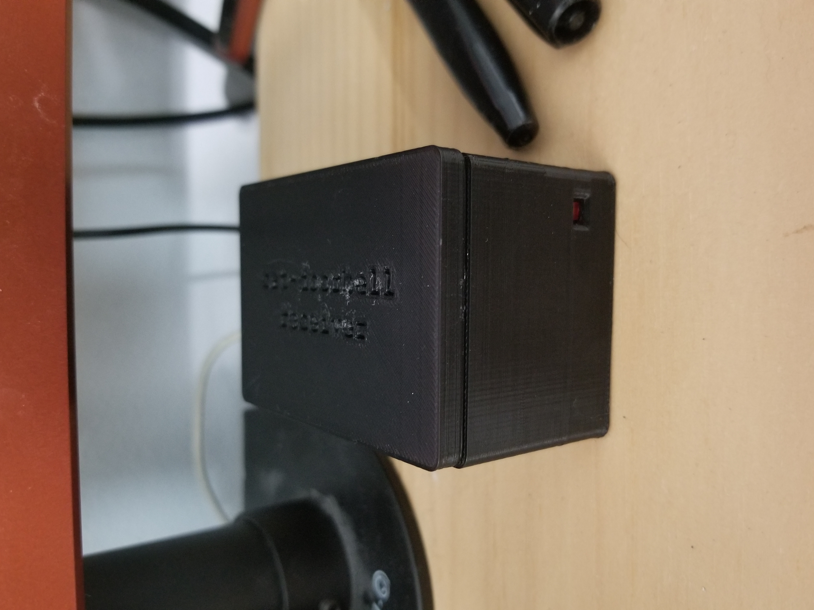
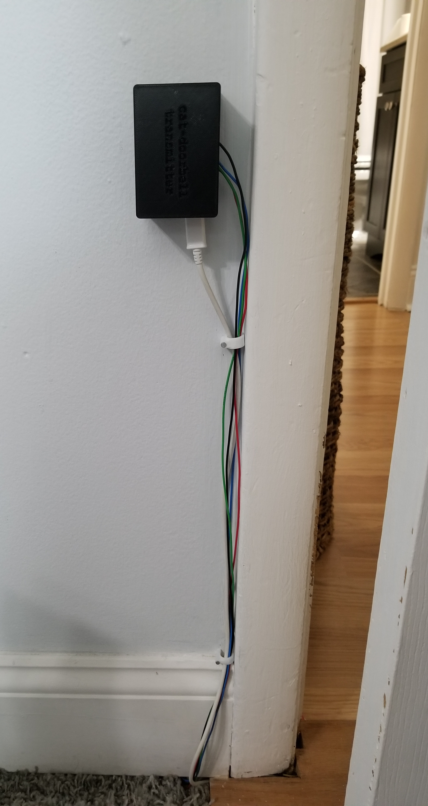

# cat-doorbell

A proximity sensor to detect my cat outside my door and flash an LED at my desk.

## Summary

I generally have noise cancelling headphones on and my cat will sit outside my door
meowing late at night when it wants to come in.

This project has two modules, a transmitter and receiver.
The transmitter module will detect my cat using a proximity sensor and send an RF
signal to the receiver module. The receiver module will activate an LED for three seconds
upon receiving an RF signal.

On the receiver module there is an optional piezo speaker that can be muted/unmuted to 
trigger at the same time as the LED. I feel like it might get annoying hence the mute button.

## Part List

- 2 x Arduino Nano ATmega328
- 2 x NRF24L01 2.4GHz Transceiver module
- 2 x 100μF electrolytic capacitor
- 2 x Micro USB breakout board
- 2 x LD1117V33 3.3V linear voltage regulator
- 2 x Red LED
- 2 x 570Ω resistor
- 1 x 100Ω resistor
- 1 x Piezo Speaker
- 1 x Switch
- 1 x Ultrasonic module HC-SR04

## Images

### Receiver

### Transmitter

## Improvements

Stuff I thought about as the project was pretty much done

- Use terminal blocks instead of four dupont cables
- A potentiometer to adjust ultrasonic sensor max range (useful for tuning)

## References

- [Platformio SparkFun Arduino Nano ATmega328](https://docs.platformio.org/en/latest/boards/atmelavr/nanoatmega328.html)
- [HC-SR04 Ultrasonic Sensor - Last Minute Engineers](https://lastminuteengineers.com/arduino-sr04-ultrasonic-sensor-tutorial/)
- [NRF24L01 - Last Minute Engineers](https://lastminuteengineers.com/nrf24l01-arduino-wireless-communication/)
